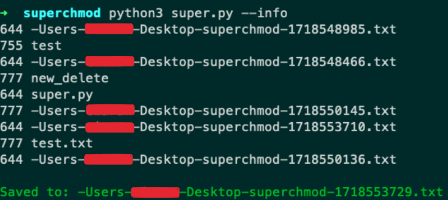
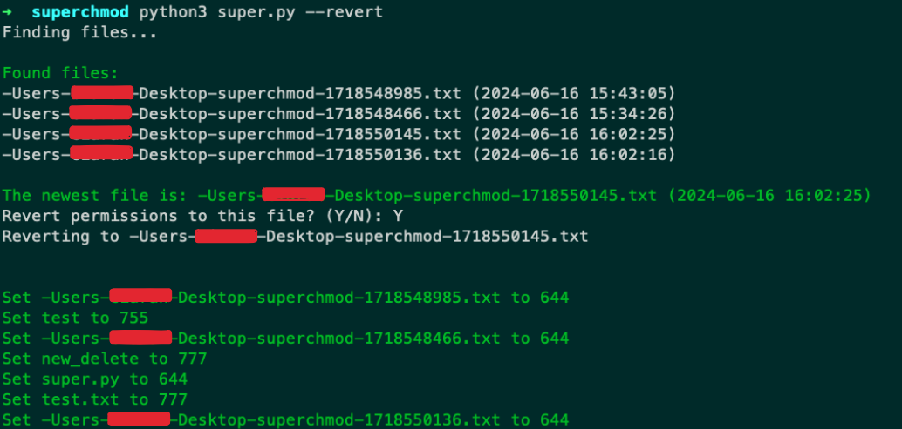

# Reverse-sudo

This code allows you to reverse a sudo chmod, in case of accidental permission changes. It first creates a backup of all the files in your current directory, then allows you to choose a state to revert back to.

## Setup

`git clone https://github.com/Insula415/reverse-sudo.git`

No external python libraries needed

## Usage

`python3 super.py`
<h3>Arguments:</h3>

* --info: outputs more information on what files the script is reading.
* --revert: starts the permission reverting process.

I recommend adding this as a bash command for easy usage. 
